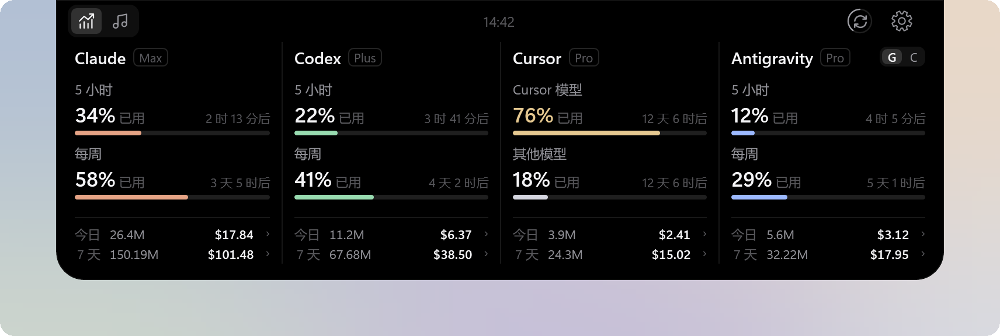
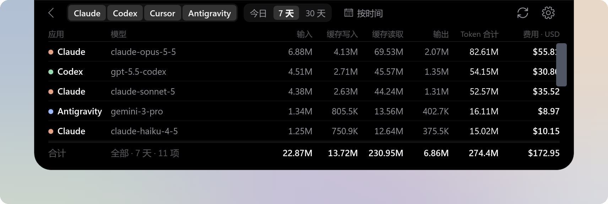
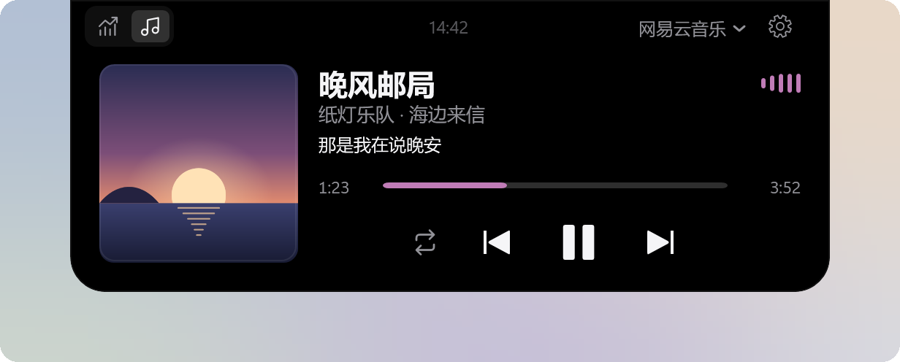
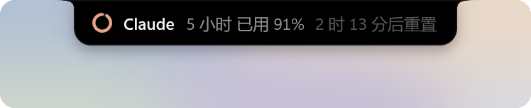
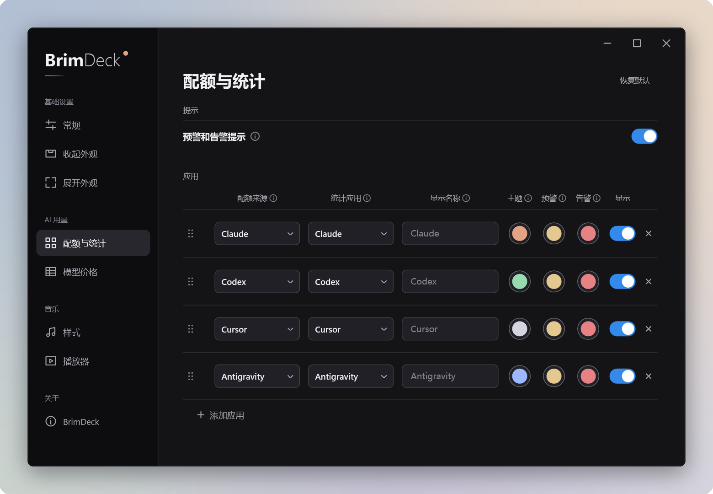

# BrimDeck

**Windows 11 上的灵动岛。AI 编程工具的剩余额度、今天的花费和正在播放的音乐，都在屏幕顶部。**

## 为什么选择 BrimDeck

- **额度集中显示**：Claude、Codex、Cursor、Antigravity 等工具的配额显示在同一个面板上，不必逐个打开网页或命令行查询。
- **不占用工作区**：平时只在屏幕顶部显示一个小小的刘海，鼠标移上去即展开，移开即收起。
- **快用完时主动提醒**：已用比例达到 70% 和 90% 时进度条变色，收起状态下也会展开几秒钟提示。
- **知道自己花了多少**：今日与最近 7 天的 Token 用量和费用估算，可以细分到每个模型。
- **顺便控制音乐**：显示封面、歌词和进度，可以播放、暂停、切歌。
- **不需要额外登录**：直接读取本机已登录的工具的数据，不上传你的对话内容。

## AI 用量

- 每个工具一列，显示套餐、各项配额的已用比例、重置倒计时，以及今日和 7 天的 Token 用量与费用。
- 已用达到 70% 显示为预警色，达到 90% 显示为告急色，颜色可以按工具分别设置。
- 数据每 60 秒自动同步一次；右上角的同步按钮可以暂停或恢复自动同步。
- 最多同时显示 7 个工具。一列放不下的配额，点击该列即可翻页。

## 模型明细

- 点击任意一列的"今日"或"7 天"，查看每个模型的输入、缓存、输出 Token 和费用。
- 可以同时选择多个工具，按今日、7 天、30 天或自选日期筛选。
- 费用优先采用工具接口给出的金额，没有时按公开的模型单价估算。估算金额仅供参考，不等于订阅的实际扣费。

## 音乐

- 显示封面、歌名、歌手、同步歌词和播放进度，提供播放模式、上一首、播放/暂停、下一首按钮，播放器支持时可以拖动进度。
- 进度条与律动条使用封面的主色，律动条跟随正在播放的声音跳动。
- 同时有多个播放器在播放时，最近开始播放的显示在前；也可以在右上角手动切换或固定某个播放器。

| 播放器 | 支持情况 |
| --- | --- |
| 网易云音乐 | 显示曲目、封面和进度。在网易云中开启 SMTC 后可以播放、暂停和切歌；开启"完整控制"后还可以拖动进度、切换随机与循环（使用前请阅读[风险说明](docs/privacy.md#网络与安全)） |
| QQ 音乐 | 显示曲目和进度，可以播放、暂停、切歌和拖动进度 |
| 其他播放器 | 接入 Windows 系统媒体控制的播放器都可以显示和控制 |

## 收起形态

平时 BrimDeck 停留在屏幕顶部中央，有三种样式可选。

<table>
  <tr>
    <td align="center"> 刘海（默认）</td>
    <td align="center"> 胶囊</td>
    <td align="center"> 指示条</td>
  </tr>
</table>

- 刘海和胶囊中，每个圆环代表一个工具，显示其各项配额中最高的已用比例；正在播放音乐时，左侧显示封面，右侧显示律动条。
- 中间也可以显示正在播放的歌名或当前一句歌词：

  

- 某项配额越过 70% 或 90% 时，收起形态会展开 5 秒显示提醒：

  

- 指示条是最不显眼的样式，可以显示播放进度。
- 窗口最大化时默认切换为指示条；玩全屏游戏或看全屏视频时默认完全隐藏，不遮挡画面。

## 按自己的习惯设置

- 每一列可以分别选择配额来源、统计哪个工具的用量、显示名称，以及主题色、预警色和告急色；拖动即可调整顺序。
- 面板尺寸提供紧凑、标准、宽敞三档，也可以自定义宽度和高度。
- 展开和收起的延迟、动画时长都可以调整，也可以关闭动画。
- 支持开机自启动；界面语言可选简体中文或英文，设置窗口可选浅色、深色或跟随系统。

## 支持的工具

| 工具 | 配额 | Token 用量与费用 | 需要的准备 |
| --- | :---: | :---: | --- |
| Claude | ✓ | ✓ | 在本机登录 Claude Code 或 Claude 桌面版。用量统计来自 Claude Code |
| Codex | ✓ | ✓ | 在本机登录 Codex |
| Cursor | ✓ | ✓ | 在本机登录 Cursor |
| Antigravity | ✓ | ✓ | 读取配额时需要 Antigravity 桌面版正在运行 |
| ZCode | ✓ | ✓ | 在本机登录 ZCode |
| 智谱 GLM、Z.ai GLM | ✓ | | 在设置中填写 API 密钥 |
| New API、Sub2API 中转站 | ✓ | | 在设置中填写站点地址和密钥 |
| 自定义 | ✓ | | 编写一段 JavaScript 脚本，见[自定义配额来源](docs/custom-sources.md) |

手动填写的来源没有本地用量记录，"今日"和"7 天"可以另选一个工具统计。

## 安装

1. 从 [Releases](https://github.com/MoFeng2223/BrimDeck/releases/latest) 下载 `BrimDeck-<版本>-Setup.exe` 并运行。需要 Windows 11（x64）。
2. 默认只为当前用户安装，不需要管理员权限；安装位置可以自选。
3. 安装包没有代码签名，Windows 可能提示"Windows 已保护你的电脑"。点击"更多信息"，再点击"仍要运行"即可。

新版本发布后，打开设置时会自动提示，下载并校验完成后即可在应用内安装。卸载请在 Windows 设置的"应用"中进行，卸载时可以选择是否一并删除 BrimDeck 的设置与数据（默认保留）。

## 开始使用

1. 安装完成后，BrimDeck 出现在主显示器顶部中央，默认显示 Claude 和 Codex。
2. 把鼠标移到刘海上即可展开，移开或按 Esc 收起。
3. 在面板上单击右键，或右键单击系统托盘图标，打开设置并添加其他工具。

## 隐私

- 只读取其他应用已有的登录状态和用量记录，不修改、续期或注销它们的登录。
- 其他应用的登录令牌只在内存中使用，不写入磁盘；你手动填写的 API 密钥使用 Windows 的加密功能保存在本机。
- 不上传对话内容，也不收集使用数据。

读取了哪些文件、会连接哪些地址，详见[数据与隐私](docs/privacy.md)。

## 常见问题

**某个工具显示"未连接"或"等待更新"怎么办？**
请确认该工具已在这台电脑上登录；Antigravity 还需要桌面版正在运行。BrimDeck 读取不到数据时，只显示实际状态，不会显示虚假的数值。

**显示的费用是我实际支付的金额吗？**
不是。费用按接口金额或公开的模型单价计算，适合用来了解用量高低；订阅套餐的实际扣费以各服务商的账单为准。

**多显示器时显示在哪里？**
显示在主显示器顶部中央，并出现在所有虚拟桌面上。

## 参与开发

欢迎提交 Issue 和 Pull Request。

## 许可证

BrimDeck 采用 [Apache License 2.0](LICENSE)。第三方组件的许可证见 [ThirdPartyNotices.txt](src/BrimDeck/ThirdPartyNotices.txt)。
