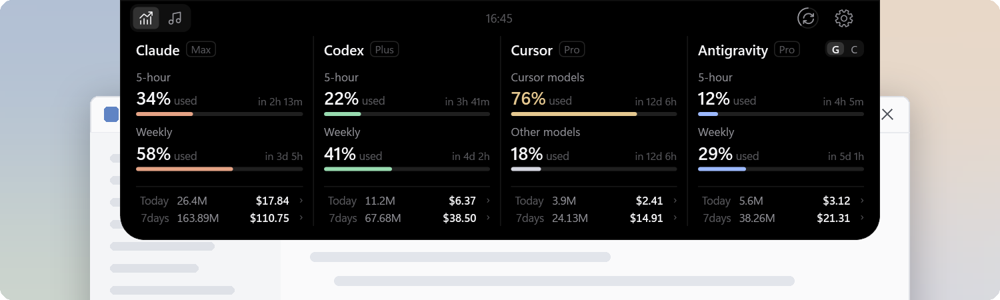
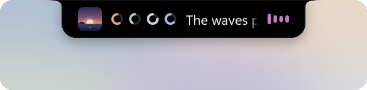
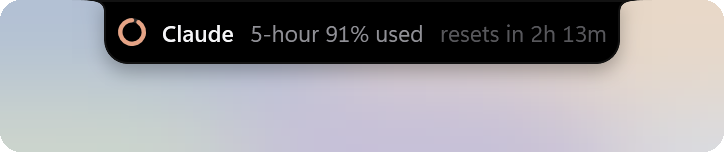
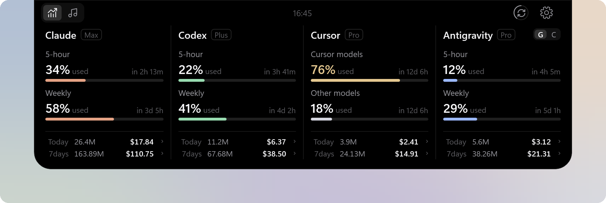
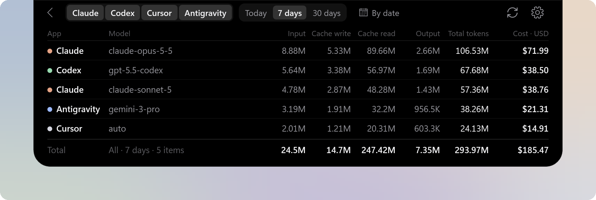
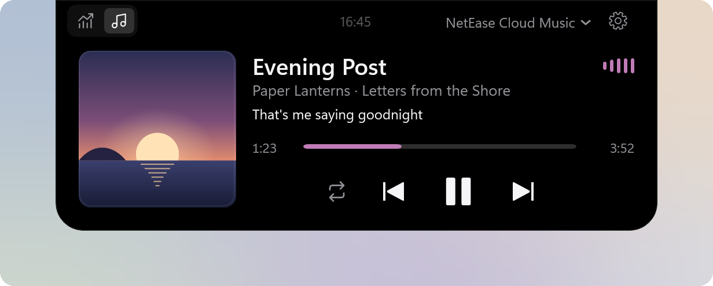

# BrimDeck - A Dynamic Island for Windows

BrimDeck is a Dynamic Island for Windows 11 that brings your AI coding tool quotas, usage and the music you are playing together at the top of the screen. 
It stays collapsed at the top of the screen and opens only when you need it. 
A native Windows app built with C# and WPF, designed for performance and smoothness.

## Why BrimDeck

- **All quotas in one place**: Quotas for Claude, Codex, Cursor, Antigravity and more are shown in a single panel, so you no longer open each website, command line or app to check them.
- **Quota checks made simple**: BrimDeck stays collapsed at the top of the screen. Move the pointer over it to open it, and move away to close it.
- **Media control**: Preview and control the song that is playing inline; the cover, equalizer and lyrics follow the music.
- **No interruptions in full screen**: Hides automatically while you play full-screen games or watch full-screen video, so it never opens by accident. Adjustable in settings.
- **Works out of the box**: Detects Claude, Codex, Cursor and other tools already signed in on this PC. No keys to enter and no extra sign-in.
- **Native Windows**: Built on .NET and WPF to deliver smooth animation with low resource use.

## Features

### Collapsed styles

BrimDeck sits at the top center of the screen and comes in three styles: Notch (default), Capsule and Indicator.

<table>
  <tr>
    <td align="center"> Notch (default)</td>
    <td align="center"> Capsule</td>
    <td align="center"> Indicator</td>
  </tr>
</table>

- Notch and Capsule show the highest quota usage of each tool as a ring, and preview the music that is playing with its cover, an equalizer, and the title or the current lyric line.

  

- Notch and Capsule can also show the time at their right end, in one of nine styles, in a color of your choice, and in 12- or 24-hour format.

- When a quota reaches 70% or 90%, the collapsed view widens and shows a notice for 5 seconds.

  

- By default it turns into the Indicator when a window is maximized, and hides during full-screen games or video so it never opens by accident.

### AI usage

- One column per tool shows the plan, quota usage and reset countdowns, for up to 7 tools at once.
- The bottom of each column totals tokens and estimated cost for today and the last 7 days.
- Token and cost details are available for each model, filtered by tool and date range.

You can choose the quota providers and set the quota and usage source of each column separately. See [Supported tools](docs/en-US/ai-tools.md).

### Music

- Shows song information, synced lyrics and playback progress, with playback controls, playback mode switching and seeking in supported players.
- Works with several players at once; switch between them or pin one.

Works with players that use Windows media controls, with extra support for some players. See [Supported players](docs/en-US/music-players.md).

## Install

Requires Windows 11 (x64).

1. Download and run `BrimDeck-<version>-Setup.exe` from [Releases](https://github.com/MoFeng2223/BrimDeck/releases/latest).
2. If Windows shows "Windows protected your PC", select "More info", then "Run anyway".

When a new version is available, you are notified when you open the settings; it is downloaded, verified and installed from within the app.

## Quick start

1. After you install and start BrimDeck, the panel appears at the top center of the primary display, showing Claude and Codex by default.
2. Move the pointer over the panel to open it; move away or press Esc to close it.
3. Select the settings button at the top right of the open panel to add tools or change settings. You can also right-click the panel, or right-click the tray icon.

## Uninstall

Uninstall BrimDeck from Apps in Windows Settings.

## Privacy

- Reads only the sign-in state and usage records that apps already keep, and never changes, renews or ends their sign-ins.
- Sign-in tokens are used only in memory and never written to disk; API keys you enter are stored on this PC, encrypted by Windows.
- Goes online only to read quotas and usage, update model prices, fetch lyrics and covers, and check for updates. Conversations are never uploaded, and no usage data is collected.

For the files BrimDeck reads and the addresses it connects to, see [Data and privacy](docs/en-US/privacy.md).

## FAQ

**A tool shows "Not connected" or "Waiting for update". What should I do?**
Make sure the tool is signed in on this PC; for example, Antigravity needs its desktop app running for its quota to be read. When BrimDeck cannot read the data, it shows the actual status and never makes up numbers.

**Is the cost shown what I actually pay?**
No. Costs come from the amounts reported by each service or from public model prices, and are meant to show how much you use. Your actual subscription charges are on each provider's bill.

## Contributing

You are welcome to report problems, suggest features or ask for more tools and players in [Issues](https://github.com/MoFeng2223/BrimDeck/issues), and to contribute through pull requests.

## License

BrimDeck is licensed under the [Apache License 2.0](LICENSE). Third-party licenses are listed in [ThirdPartyNotices.txt](src/BrimDeck/ThirdPartyNotices.txt).
