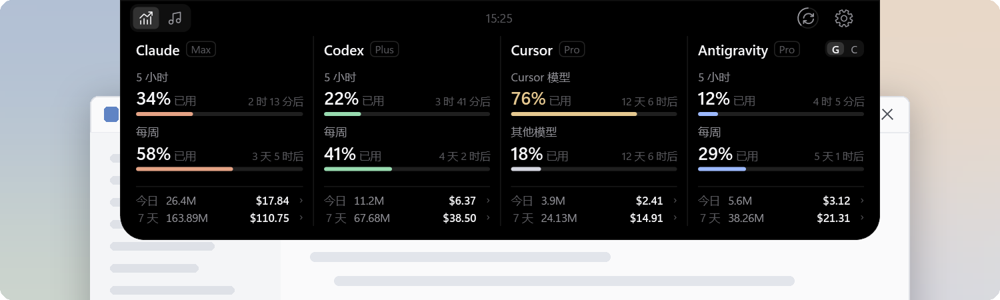
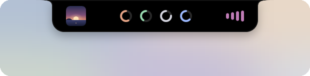
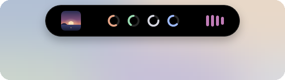
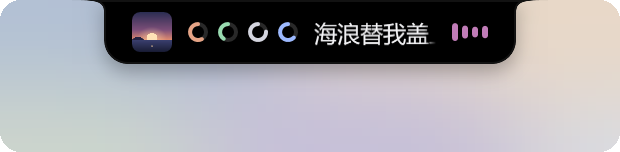
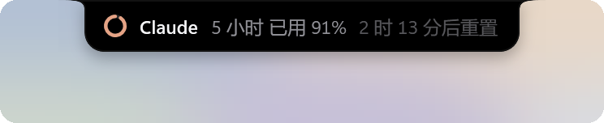
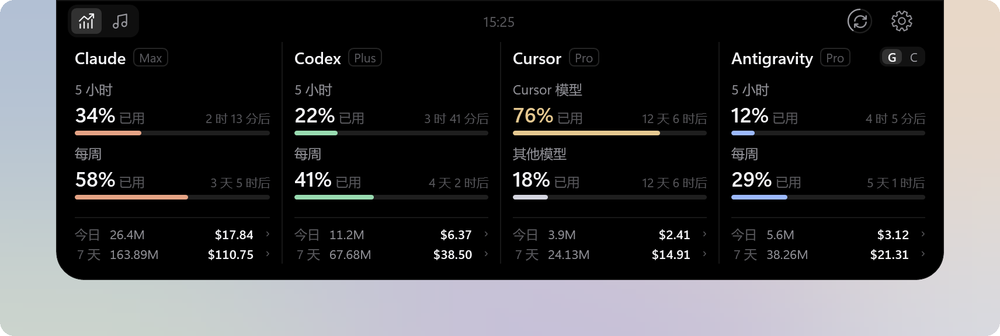
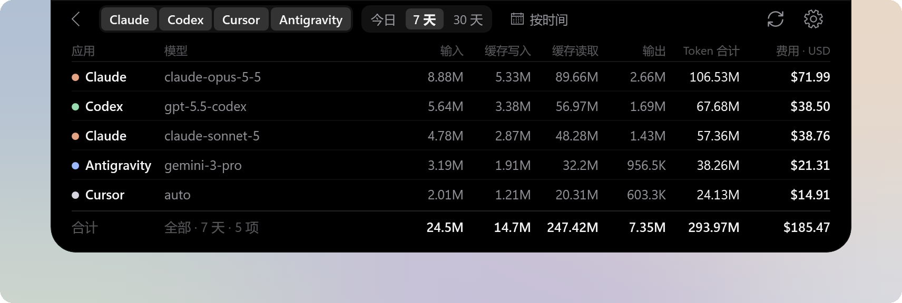
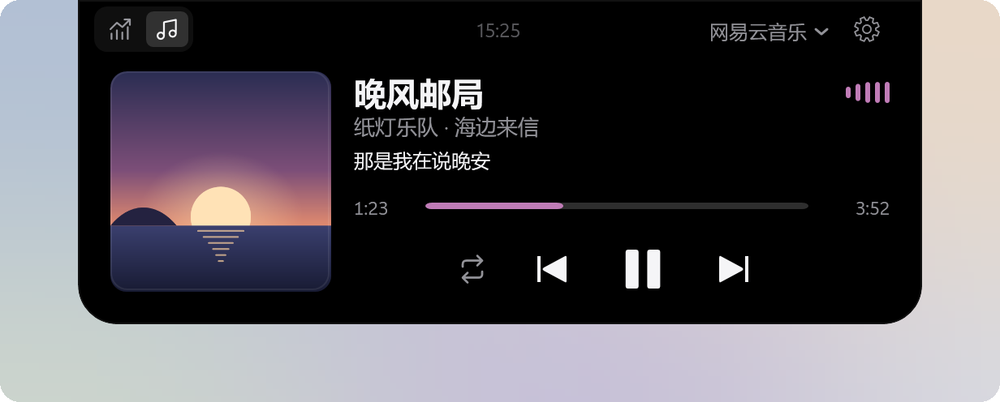

# BrimDeck - Windows 灵动岛

BrimDeck 是 Windows 11 上的灵动岛，在屏幕顶部集中显示 AI 编程工具的额度与用量，以及正在播放的音乐。 
平时收起在屏幕顶部，只在需要时展开。 
Windows 原生应用，使用 C# 与 WPF 开发，注重性能与流畅度。

## 为什么选择 BrimDeck

- **额度集中显示**：Claude、Codex、Cursor、Antigravity 等工具的额度集中在一个面板上，不必逐个打开网页、命令行或应用查看。
- **简化额度查询操作**：平时收起在屏幕顶部，鼠标移上去即展开，移开即收起。
- **媒体控制**：内联预览与控制正在播放的歌曲，封面、律动条与歌词随音乐变化。
- **全屏免打扰**：全屏玩游戏或看视频时自动隐藏，避免误触展开；可在设置中调整。
- **开箱即用**：自动识别本机已登录的 Claude、Codex、Cursor 等工具，无需填写密钥或重新登录。
- **Windows 原生**：基于 .NET 与 WPF 构建，以较低的资源占用提供流畅的动画体验。

## 功能

### 收起形态

BrimDeck 平时位于屏幕顶部中央，提供刘海（默认）、胶囊和指示条三种样式。

<table>
  <tr>
    <td align="center"> 刘海（默认）</td>
    <td align="center"> 胶囊</td>
    <td align="center"> 指示条</td>
  </tr>
</table>

- 刘海与胶囊通过配额环显示各工具的最高配额使用率，并支持音乐预览，可显示封面、律动条、歌名或当前歌词。

  

- 配额使用率达到 70% 或 90% 时，收起形态自动加宽并显示提醒 5 秒。

  

- 窗口最大化时默认切换为指示条，全屏游戏或视频播放时默认隐藏，避免误触展开。

### AI 用量

- 按工具分列展示套餐、配额使用率与重置倒计时，最多同时显示 7 个工具。
- 每列底部汇总今日和最近 7 天的 Token 用量与费用估算。
- 可查看各模型的用量与费用明细，支持按工具和日期范围统计。

可自定义配额提供商，并分别设置各列的配额与用量统计来源，详见[支持的工具](docs/zh-CN/ai-tools.md)。

### 音乐

- 显示歌曲信息、同步歌词与播放进度，支持播放控制、播放模式切换，以及受支持播放器的进度调节。
- 支持同时接入多个播放器，可手动切换或固定显示其中一个。

支持接入 Windows 系统媒体控制的播放器，并对部分播放器做了专门优化，详见[播放器支持](docs/zh-CN/music-players.md)。

## 安装

需要 Windows 11（x64）。

1. 从 [Releases](https://github.com/MoFeng2223/BrimDeck/releases/latest) 下载并运行 `BrimDeck-<版本>-Setup.exe`。
2. 如出现“Windows 已保护你的电脑”提示，点击“更多信息”→“仍要运行”。

有新版本时，打开设置即可收到更新提示，下载并校验后可直接在应用内安装。

## 快速开始

1. 安装并启动 BrimDeck 后，面板会出现在主显示器顶部中央，默认显示 Claude 和 Codex。
2. 将鼠标移到面板上即可展开，移开鼠标或按 Esc 收起。
3. 点击展开面板右上角的设置按钮，即可添加工具或调整设置；也可右键点击面板，或通过系统托盘图标的右键菜单进入设置。

## 卸载

前往 Windows 设置中的“应用”卸载。

## 隐私

- 仅读取应用已有的登录状态与用量记录，不会修改、续期或注销它们的登录。
- 读取的登录令牌仅在内存中使用，不写入磁盘；手动填写的 API 密钥使用 Windows 的加密功能保存在本机。
- 仅在获取配额与用量、同步模型单价、获取歌词与封面、检查更新时联网，不会上传会话内容，也不会收集使用数据。

读取了哪些文件、会连接哪些地址，详见[数据与隐私](docs/zh-CN/privacy.md)。

## 常见问题

**某个工具显示"未连接"或"等待更新"怎么办？**
请确认该工具已在这台电脑上登录；例如 Antigravity 读取配额时需要桌面版正在运行。BrimDeck 读取不到数据时，只显示实际状态，不会显示虚假的数值。

**显示的费用是我实际支付的金额吗？**
不是。费用按接口金额或公开的模型单价计算，适合用来了解用量高低；订阅套餐的实际扣费以各服务商的账单为准。

## 参与开发

欢迎通过 [Issues](https://github.com/MoFeng2223/BrimDeck/issues) 反馈问题、提出功能建议，或申请适配更多工具与播放器，也欢迎提交 Pull Request 参与开发。

## 许可证

BrimDeck 采用 [Apache License 2.0](LICENSE)。第三方组件的许可证见 [ThirdPartyNotices.txt](src/BrimDeck/ThirdPartyNotices.txt)。
